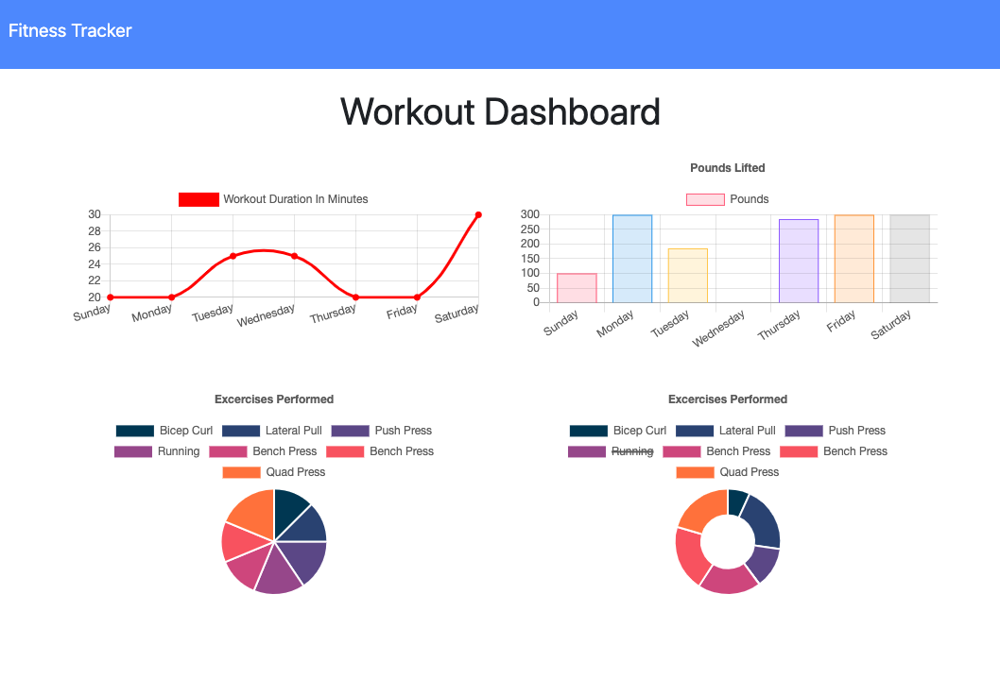

# Workout Tracker / [Demo](https://mighty-hollows-42000.herokuapp.com/?id=5eadab271419d40017417240)


## Description

The workout tracker is a web app that helps you manage your daily exercise schedule. You can track two categories of exercises, Cardio or Resistance, and enter corresponding stats like time spent doing the exercise, total sets, weights in pounds, and others. The app also includes a Workout Dashboard where you can see some graphs of your daily workouts.    

## Technologies

- [Node.js](https://nodejs.org/en/) 
- [Express](https://expressjs.com/) 
- [MongoDB](https://www.mongodb.com/)
- [Mongoose](https://mongoosejs.com/)


## Usage and Installation

Feel free to clone or fork this repo if you find it useful. To install dependencies make sure to run:

```
npm i
```

You will also need to install [MySql Workbench](https://www.mysql.com/products/workbench/) or some other application that handles SQL databases. Before spinning up the server use the schema.sql to build up the database with MySql Workbench.

If everything is ok you should be able to see this app running locally in your browser at localhost:8080. 

## Demo

You can see a demo of this app [here](https://mighty-hollows-42000.herokuapp.com/?id=5eadab271419d40017417240)

## Contributing

If you wish to contribute to this project please do a pull request. That be super cool.

## Questions?


Have any questions? Want to collaborate on a project? Shoot me an [email](yarocruz@gmail.com)
